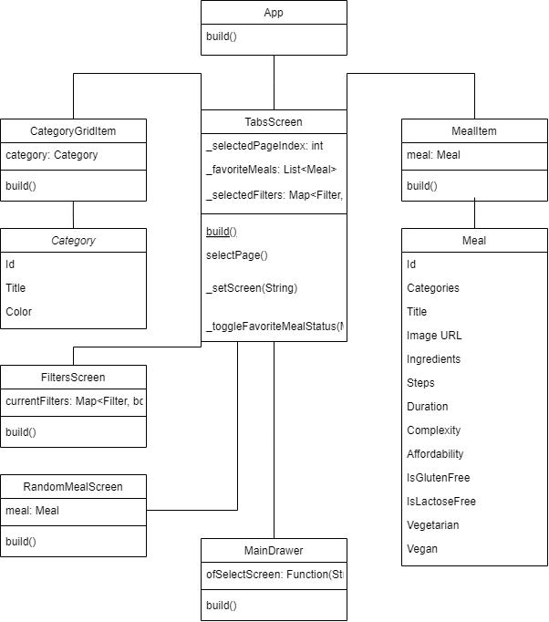
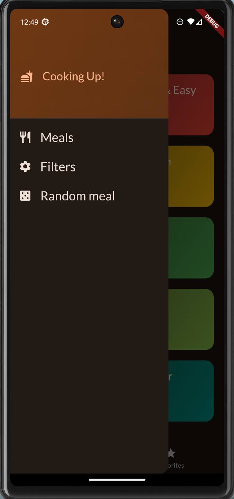
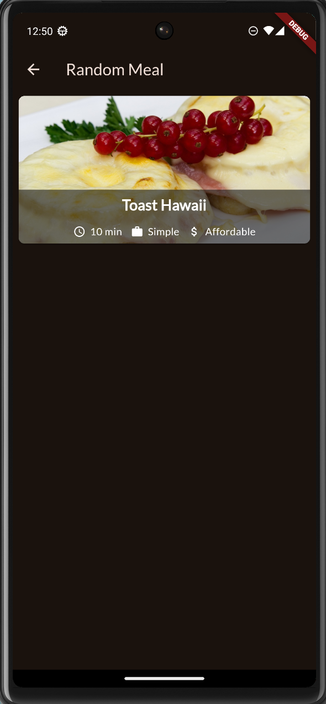

# Assignment 1 - Meals Application

This is a meals application made in the course IDATA2305 - Mobile Application. The applcation is made my following the tutorial, section 8: Building Multi-Screen Apps & Navigating Between Screens [MEALS APP] from the Udemy course "Flutter & Dart" - The complete Guide [2024 Edition]. Here is a [link](https://www.udemy.com/course/learn-flutter-dart-to-build-ios-android-apps/?couponCode=SKILLS4SALEA) to the online course.

## Installation
1. Clone this repository meals_app  
    Use one of the following commands to clone the meals_app repository:
* HTTPS

    https://github.com/birgilv/mobile-applications.git

* SSH
    
    git@github.com:birgilv/mobile-applications.git

2. Select an Emulator 
    Choose an emulator to launch for testing the application.
3. Navigate to the ``main.dart`` File  
    Open the ``main.dart`` file and locate the ``main`` function.
4. Run the Application  
    Execute the application to start using the meals app.

## App architecture

### The layers
* **Data layer** is responsible for storing and retrieving data, which in this app consists of dummy data for categories and meals.
* **Model layer** defines the structure of the data that flows through the application and encapsulates the business logic. These models define how the app’s data is structured and are responsible for holding the data that will be displayed in the UI.
* **View/UI layer**  is responsible for displaying data and handling user interaction. It includes all the screens and widgets that users interact with. This layer is typically a combination of both view and presentation logic.

## User stories
The user starts the application with a home screen. The home screen is vibrant and features various categories of meals represented by colorful tiles. Each tile displays a card with the name of the meal category. By tapping on a category tile, the user is taken to the meals screen, which showcases all meals within that category.

On the meals screen, the user sees a list of meals with their respective images, titles, and a brief description. When the user clicks on a meal card, the app navigates to the meal detail screen, which provides comprehensive information about the selected meal, including ingredients, preparation steps, and dietary information.

If the user wants to save their favorite meals, they can tap the favorite button on the meal detail screen. This action adds the meal to their favorites list. The user can access their favorite meals from a dedicated section accessible via the navigation tabs.

When the user finishes exploring the meal details, they can return to the meals screen by pressing the back button. From there, they can choose another category or explore their favorites.

If the user wishes to filter meals based on dietary preferences (like gluten-free or vegan), they can open the filters screen through the navigation drawer. After selecting their preferred filters, the user can apply them to see only meals that meet their dietary requirements.

If the user is unsure of what meal they want, they can open the random meal screen throgh the navigation drawer as well. After chosen, the user is redirected to a random meal. By pressing the tile, it navigates to the detailed discription. The user can return back to homescreen by pressing the back button.

Once the user is done with the app, they can easily navigate back to the home screen, where they can choose to explore a different category or exit the app. 

## Specififcation
The Meals App is a user-friendly application built with Flutter and Dart that allows users to explore various meal categories, view detailed information about meals, and manage their favorite dishes. The app opens with a home screen showcasing different meal categories represented by colorful tiles. Each tile features an appealing image and the name of the meal category, encouraging users to tap and explore.

## File and folder structure

* **lib** is the main directory that contains all the core functionality of the Meal App, including screens, widgets, and app logic
    * **/main.dart** is the main entry point of the application, responsible for setting up the app’s theme and displaying the TabsScreen, which manages the app’s navigation between categories and favorites.
* **lib/data** stores static or dummy data that the app uses.
    * **/dummy_data.dart** provides a list of dummy meal categories and meal data that are used throughout the app for demonstration purposes.
* **lib/models** defines the structure of key data models used in the app
    * **/category.dart** defines the structure of a meal category, which includes the title and color.
    * **/meal.dart** defines the structure of a meal, which includes its title, duration, complexity, affordability, and other attributes.
* **lib/screens** contains the different screens of the app that the user navigates between
    * **/tabs.dart** handles the main navigation between the "Categories" and "Favorites" screens using a bottom navigation bar. It also manages filtering of meals and favorites.
    * **/categories.dart** displays all the meal categories available for selection.
    * **/meals.dart** shows a list of meals, either based on the selected category or favorite meals.
    * **/filters.dart** allows users to set filters for meals (e.g., gluten-free, vegetarian) and updates the meal list based on those preferences.
    * **/random_meal.dart** displays a randomly selected meal from the list of all available meals.
* **lib/widgets** contains reusable UI components that are shared across different parts of the app.
    * **/main_drawer.dart** contains the side drawer widget, which provides navigation to the filters and random meal screens.
    * **/category_grid_item.dart** represents a grid item for each meal category, showing its title and background color.
    * **/meal_item.dart** displays individual meal information, including an image and attributes like duration, complexity, and affordability.
    * **/meal_item_trait.dart** is a helper widget used within meal_item.dart to display meal attributes such as cooking time, complexity, and cost.

## Class diagram

## Group work
I completed the task for this assignment individually without a group.

## Additional feature
The additional feature "Random Meal" allows users to discover a new meal at the click of a button. In the drawer, there is added an option 'Random meal'. When pressed, it presents a randomly selected meal from the app’s meals, offering a surprise dining option. This feature enhances user engagement by introducing variety and spontaneity into meal selection.

### Advantages
1. Provides users with an enjoyable way to explore new dishes they might not have considered otherwise, encouraging culinary experimentation.
2. The element of surprise can enhance user satisfaction, making meal planning more exciting and less monotonous. 
3. It caters to users who may feel overwhelmed by choices, simplifying the decision-making process. 
4. The feature aligns with modern UX trends, promoting engagement through interactive and fun elements.

