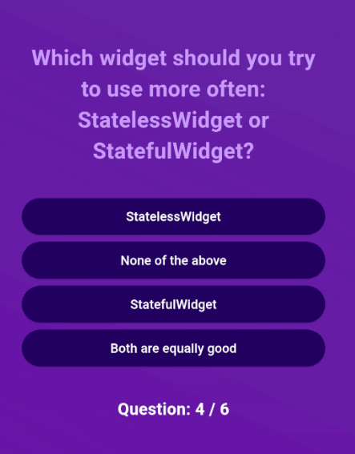

# Assignment 1 - Quiz Application

This is an quiz application made in the course IDATA2305 - Mobile Application. The applcation is made my following the tutorial, section 3: Flutter & Dart Basics II - Fundementals deep dive [QUIZ APP], from the Udemy course "Flutter & Dart" - The complete Guide [2024 Edition]. Here is a [link](https://www.udemy.com/course/learn-flutter-dart-to-build-ios-android-apps/?couponCode=SKILLS4SALEA) to the online course.

## App architecture
The Quiz App follows a simple, structured architecture that separates files into different layers. The architecture is designed for maintainability and scalability, focusing on breaking down the app's functionality into smaller, reusable components. This approach leverages the strengths of Dart and Flutter in creating clean, responsive, and fast UI applications.

### The layers
* **Data layer** which holds the data that powers the application. This includes the file questions.dart which contains the questions to displayed.
* **Model layer** which defines the datastructure. The file quiz_questions.dart defines the stucture of the question. 
* **View/UI layer** which manages the userinterface and interactions. The layer handles the screen swithing and other components such as the answer button and process bar.

## User stories
The user stats the application with a start screen. The start screen is simple, and contains a picture and a start button. By pressing the start button the quiz is started and the screen swithces from the start- to the questionscreen.

The questionsscreen shows a single question with a text and possible 4 answers. The answers is displayed with clickable buttons under the questiontext. At the botton of the questionscreen, a progress indicator shows the users progress of the quiz. The indicator is in the format **current question / the total amount of questions**. The answer list is shuffled, so the answers is displayed in ransomized order. The user can only select one answer for each question, and chooses their answer by clicking on the answer. 

When the user has completed the quiz, the screen switches from the question- to the resultsscreen. The resultsscreen displays **the number of questions answerd corrctly / the total amount of questions**. Below, all the questions is displayed with the question text, the user chosen answer and correct question, as well as a color indicator for corrctly answered or not. This is a scrollable list and at the bottom of the screen is a restart button.

If the user press the restart button, the quiz is reset. The user is redirected to the start screen, where the screen switches from the results- to the startscreen. The user is now able to restart the quiz, and all the previous answers is cleard. 

## Specififcation
A simple quiz application created with Flutter and Dart, where a user can answer multiple-choice questions and get a summary of their results. The quiz opens with the start screen where a start quiz button is displayed. When the quiz is started a question screen with a single question is shown. This is a multiple-choice quiz question with four options, and a progress indicator to show how many questions are left. When the quiz is completed the result screen is displayes, where a summary the user's performance is shown.

## File and folder structure
This structure ensures a separation of concerns, clean organization, and maintainability. Each file has a specific role within the app’s architecture. This breakdown allows each screen and widget to be modular, making it easier to maintain and enhance specific parts of the app as the quiz evolves or gains new features.

* **lib** houses the main functionality of the app, including screens (start, quiz, result), UI components, and central quiz logic.
    * **/main.dart** is the main entry point of the application and manages initial routing and setting up the app’s navigation structure.
    * **/quiz.dart** is the core logic of the quiz, and manages quiz state, transitions between questions, and collects answers.
    * **/start_screen.dart** is the initial screen where the user starts the quiz.
Contains a button that initiates the quiz.
    * **/questions_screen.dart** is the main quiz screen that displays the current question and possible answers.
    * **/results_screen.dart** displays the user’s quiz results after the quiz is complete.
    * **/answer_button.dart** contains the widget for rendering the quiz answer buttons and handles user interaction for answer selection.
    * **/process_indicator.dart** displays a progress bar showing how many questions are left in the quiz.
* **lib/data** stores the raw data, like quiz questions, that is used across the app.
    * **/questions.dart** stores a list of quiz questions and acts as a central repository for quiz data
* **lib/models** defines the data structure of key elements (e.g., quiz questions).
    * **/quiz_questions.dart** defines the structure of a quiz question (e.g., question text, answer options, correct answer).
* **lib/questions_summary** contains all widgets and files related to displaying the quiz summary and individual question results.
    * **/questions_summary.dart** displays a summary of the quiz results, showing each question and its correct answer.
    * **/summary_item.dart** is a widget that helps display individual items in the quiz summary.
    * **/question_identifier.dart** is a helper file to identify which question is being displayed.

## Class diagram

## Group work
I completed the task for this assignment alone without a group. Therefore, there is not much to say about the teamwork for this project.

## Additional feature
For the additional feature a progress indicator was added. The progress indicator display the current question of the total amount of questions in the questionset. Typically used on webpages, such as newspaper or photo galleries. By adding a progress indicator the user knows their progress throughout the quiz. The see both their current question number and the total amout of question to answer. 

### Advantages
1. The user gets **visual feedback**, which provides a clear, visual indication of how far the user have progressed, allowing them to understand how much of the quiz is left. 
2. Completing a progress indicator can give the user a small, rewarding a sense of **achievement**.
3. Without a progress indicator, users might feel lost or unsure how long the quiz will take. A progress bar **reduces this uncertainty**.
4. **UX-standards** includes that modern apps and websites use progress indicators, so users are accustomed to them. 

### Other ideas
* A restart or exit button to be displayed throughout the quiz. The selected answers should be saved and if the user selects restart, the data is cleared and a new quiz is started. If the user selects exit, the answers should be saved as a *saved quiz* which can be continued with the *continue quiz* option on the startscreen.
* If the user have to interrupt the quiz, and want to finish it later, the quiz should be able to store the users answers. On the startscreen have an option *continue quiz*
* Save the completed quizzes in the application. On the startscreen have an option *review completed quizzes* where the user can review all of their previous quizzes. 